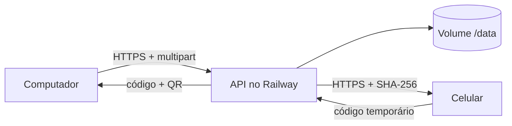

# Ponte

Sistema para enviar fotos e documentos de um dispositivo e baixar em outro usando:

- **GitHub Pages** para a interface estática;
- **Railway** para a API e o armazenamento temporário;
- **Railway Volume** para os arquivos sobreviverem a reinícios do serviço.

O remetente seleciona os arquivos, recebe um código de oito caracteres e um QR Code. O outro aparelho abre o link ou digita o código, confere os arquivos e baixa. Antes de liberar o download, o navegador compara o hash SHA‑256 com o hash calculado pela API.



## Recursos incluídos

- até 10 arquivos por envio;
- JPG, JPEG, PNG, PDF, Word, Excel e PowerPoint;
- 25 MB por arquivo e 100 MB por envio, configuráveis;
- cota padrão de 100 MB enviados por dia, também configurável;
- expiração automática em no máximo 24 horas;
- exclusão imediata usando uma chave mantida somente no aparelho remetente;
- progresso real de upload e download;
- verificação SHA‑256 antes de iniciar o download;
- QR Code e link que levam o código e o domínio correto da API ao receptor;
- proteção CORS, Helmet, limitação de requisições e validação de extensão/MIME;
- PWA instalável no celular e computador;
- testes automáticos do frontend e da API.

## Estrutura

```text
index.html                    interface publicada no GitHub Pages
styles.css                    visual responsivo
app.js                        upload, QR/código, download e SHA-256
config.js                     configuração local; não contém segredo
manifest.webmanifest          instalação como aplicativo
sw.js                         cache do shell da aplicação
icons/                        ícones do aplicativo
.github/workflows/pages.yml   testes e publicação no GitHub Pages
tests/                        testes do frontend
server/
  src/app.mjs                 API, armazenamento, cota e limpeza
  src/index.mjs               inicialização e encerramento seguro
  tests/api.test.mjs          testes integrados da API
  Dockerfile                  imagem usada pelo Railway
  railway.json                healthcheck e política de reinício
  .env.example                variáveis disponíveis
```

## Publicação completa

### 1. Envie o projeto ao GitHub

O conteúdo deve ficar na branch `main` do repositório. O workflow já incluído testa as duas partes e publica somente os arquivos estáticos; a pasta `server` não é exposta pelo GitHub Pages.

No GitHub, abra **Settings → Pages** e selecione **GitHub Actions** como fonte de publicação.

### 2. Crie a API no Railway

No Railway:

1. crie um projeto a partir deste repositório GitHub;
2. no serviço criado, defina **Root Directory** como `/server`;
3. adicione um **Volume** com o caminho de montagem `/data`;
4. adicione as variáveis abaixo;
5. gere um domínio público para o serviço;
6. abra `https://SEU-DOMINIO/health` e confira a resposta `{"status":"ok","service":"ponte-api"}`.

Variáveis recomendadas:

```env
STORAGE_DIR=/data/ponte
FRONTEND_ORIGINS=https://deuzimarsouza.github.io
FILE_TTL_HOURS=24
MAX_FILE_SIZE_MB=25
MAX_BATCH_SIZE_MB=100
DAILY_QUOTA_MB=100
MAX_FILES=10
CLEANUP_INTERVAL_MINUTES=15
DELETE_AFTER_DOWNLOAD=false
TRUST_PROXY_HOPS=1
```

O Railway define `PORT` automaticamente. Não crie essa variável manualmente.

Se o frontend também usar um domínio próprio ou outro ambiente de teste, inclua as origens separadas por vírgula em `FRONTEND_ORIGINS`. Informe somente a origem (`https://exemplo.com`), sem caminho e sem barra final.

> O Volume é indispensável para manter arquivos após reinícios ou novos deploys. Sem ele, a API ainda funciona, mas os arquivos podem desaparecer antes do prazo.

### 3. Ligue o GitHub Pages ao Railway

Copie o domínio público da API, sem barra no final. No repositório GitHub, abra:

**Settings → Secrets and variables → Actions → Variables → New repository variable**

Crie:

```text
Nome: PONTE_API_URL
Valor: https://seu-servico.up.railway.app
```

Depois, execute novamente o workflow **Publicar frontend no GitHub Pages**. O arquivo `config.js` é gerado durante a publicação com esse domínio.

Se a variável ainda não tiver sido criada, a página abrirá uma janela para digitar o domínio do Railway. O endereço fica salvo somente no navegador e também segue no link/QR Code, portanto o receptor não precisa configurá-lo.

## Testar localmente

### API

```bash
cd server
npm ci
STORAGE_DIR=./storage FRONTEND_ORIGINS=http://localhost:8080 npm start
```

### Frontend

Em outro terminal, na raiz do projeto:

```bash
python3 -m http.server 8080
```

Abra `http://localhost:8080`, entre em **Menu → Configurar Railway** e use `http://localhost:3000`.

## Executar os testes

Na raiz:

```bash
node --test tests/*.mjs
```

Na API:

```bash
cd server
npm ci
npm test
```

## Endpoints da API

| Método | Rota | Função |
| --- | --- | --- |
| `GET` | `/health` | healthcheck do Railway |
| `GET` | `/api/config` | limites públicos usados pelo frontend |
| `POST` | `/api/shares` | recebe multipart no campo `files` e cria a ponte |
| `GET` | `/api/shares/:code` | devolve metadados dos arquivos ativos |
| `GET` | `/api/shares/:code/files/:fileId` | baixa um arquivo e envia o hash no cabeçalho |
| `DELETE` | `/api/shares/:code` | apaga a ponte usando `X-Delete-Token` |

## Regras de armazenamento

- A cota diária soma os bytes enviados e reinicia à meia-noite UTC.
- Apagar uma ponte antes do prazo não devolve cota do mesmo dia.
- O processo verifica itens expirados ao iniciar e a cada 15 minutos por padrão.
- `FILE_TTL_HOURS` nunca ultrapassa 24 horas, mesmo se uma variável maior for informada.
- Com `DELETE_AFTER_DOWNLOAD=true`, a ponte é apagada após todos os arquivos terem sido baixados ao menos uma vez.
- Esta versão usa arquivos JSON e deve rodar com uma única réplica. Para várias réplicas, migre metadados e objetos para um armazenamento compartilhado apropriado.

## Privacidade e segurança

Esta versão não é P2P. O arquivo viaja por HTTPS e fica temporariamente no Railway. O código funciona como credencial de leitura: qualquer pessoa que tenha o código e o endereço da API pode baixar enquanto a ponte estiver ativa.

Não há criptografia ponta a ponta implementada pela aplicação e não há antivírus. Para arquivos confidenciais, adicione criptografia no navegador antes do upload, autenticação e varredura de malware.
